# Sokoban

## Spis treści
* [Wstęp](#wstep)
* [Informacje wstępne]
* [Elementy aplikacji]
* [Cel gry]
* [Elementy wizualne aplikacji]
* [Elementy dodatkowe]
* [Sterowanie]

<a name="wstep">
## Wstęp

Niniejsza instrukcja dotyczy gry Sokoban przygotowanej przez studentów czwartego semestru kierunku Elektronika na Wydziale Elektroniki i Technik Informacyjnych Politechniki Warszawskiej w ramach projektu z przedmiotu Programowanie Zdarzeniowe (PROZE). Autorami projektu są: Jakub Wrzosek oraz Hubert Jaworski.
W kolejnych punktach zostaną przedstawione najważniejsze informacje na temat użytkowania aplikacji.

## Informacje wstępne

Aplikacja została napisana w języku Java w wersji 8. Do jej uruchomienia niezbędne jest posiadanie na swoim komputerze zainstalowanego środowiska uruchomieniowego Javy (JRE) służącego do uruchomienia aplikacji .jar. W wypadku naszej aplikacji niezbędne jest posiadanie Java SE Runtime Enviroment 8.
 

Jeśli nie posiadamy niezbędnego środowiska uruchomieniowego, możemy pobrać je ze strony internetowej Oracle: http://www.oracle.com/technetwork/java/javase/downloads/jre8-downloads-2133155.html

## Elementy aplikacji
Aplikacja składa się z plików z kodem źródłowym programu, plików konfiguracyjnych zawierających elementy niezbędne do prawidłowego funkcjonowania programu (definicję poziomów) oraz z pliku uruchomieniowego z rozszerzeniem .jar.

## Cel gry

Na rozgrywkę składają się następujące elementu: gracz, skrzynie, ściany oraz miejsca docelowe dla skrzyń.
Celem gracza jest ustawienie skrzyń na miejscach docelowych, z tym faktym, iż gracz może poruszać paczki tylko w kierunkach poruszania się tj. w górę, w dół, w lewo i w prawo po terenie ograniczonym przez ściany.
W momencie ustawienia skrzyń na miejscach docelowych gracz przechodzi do kolejnego poziomu. Po przejściu wszystkich poziomów gracz zwycięża oraz zostaje sklasyfikowany z możliwością znalezienia się w oknie z trzema najlepszymi wynikami.

## Elementy wizualne aplikacji

### Okno główne aplikacji

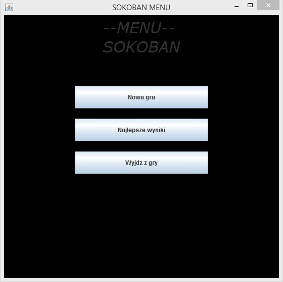

Powyższa grafika przedstawia okno główne aplikacji. Możemy w nim wyodrębnić cztery elementu głowne. Jednym z nich jest napis informujący, iż znajdujemy się w menu gry Sokoban. Pozostałymi trzema elementami są przyciski, za pomocą których możemy wybrać interesującą nas w danej chwili akcję. 
 

Pierwszym przyciskiem od dołu jest „Wyjdź z gry”. Wciśniecie tego przycisku powoduje zamknięcie aplikacji. Warto zaznaczyć, iż ten sam skutek możemy osiągnąć klikając czerwoną ikonkę z „iksem” w prawym górnym rogu okna.
 

Środkowy przycisk „Najlepsze wyniki” pozwala nam przejść do okna zawierającego trzy najlepsze wyniki.
 

Przycisk na samej górze wywołuję akcję prowadzącą do rozpoczęcia rozgrywki. Po jego wciśnięciu aplikacja rozpoczyna dialog z użytkownikiem, mający na celu pobranie od niego nicku oraz wybór przez użytkownika poziomu trudności.
 

Po wciśnięciu przycisku „Nowa gra” naszym oczom ukaże się okno następujące okno dialogowe:
 

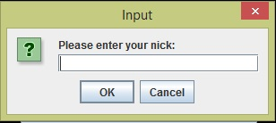
 

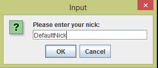
 

W tym momencie powinniśmy podać nick i kliknąć przycisk „OK” aby przejść dalej. W tym miejscu warto zaznaczyć, że kliknięcie „Cancel” lub czerwonej ikonki z „iksem” spowoduje powrót do głównego menu. Podanie nieprawidlowego nicku (tzn. chęć zatwierdzenia bez wprowadzenia żadnego znaku) spowoduje wyświetlenie następującego okna:
 

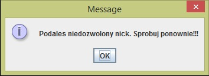
 

Po wciśnięciu „OK” nastąpi powrót do menu głównego.
 

Załóżmy, że podanie nicku zakończyło się sukcesem. Kolejnym krokiem jest wybór poziomu trudności. Po zatwierdzeniu podanego nicku, naszym oczom ukaże się okno umożliwające wybór jednego z trzech przewidzianych poziomów trudności: Easy, Medium oraz Hard.
 

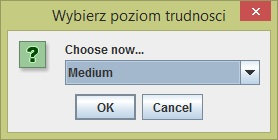
 

Po wciśnięciu strzałki po prawiej stronie od podświetlonego napisu „Medium” rozwinie się lista ze wszystkimi dostępnymi poziomami trudności. W przypadku kliknęcia opcji „Cancel” lub czerwonej ikonki z „iksem” nastąpi powrót do menu głównego.
 

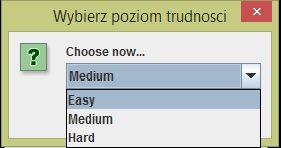
 

Po wybraniu poziomu trudności oraz kliknięciu „OK” przechodzimy do okna rozgrywki.
 

### Okno z najlepszymi wynikami

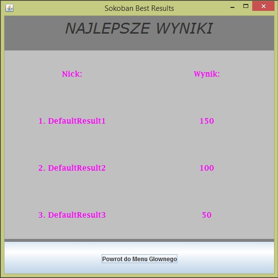
 

Jak widzimy okno z najlepszymi wynikami pokazuje nam trzy najlepsze wyniki uzyskane w przeszłości przez użykowników.
W południowej części okna znajduje się przycisk „Powrót do Menu Głównego”, po wciśnięciu którego program przenosi nas spowrotem do menu głównego.
 

### Okno rozgrywki

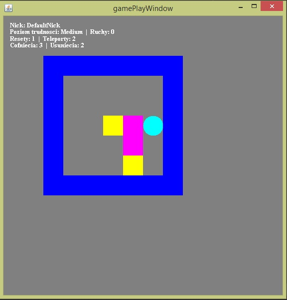
 

Na ekranie możemy zauważyć kilka różnych elementów. Zaczynając od góry mamy klika napisów przedstawiających informacje o rozgrywce. Wśród napisów możemy zauważyć swój nick, wybrany wcześniej poziom trudności, liczbę wykonanych ruchów oraz liczbę dostępnych elementów dodatkowych („mocy”) takich jak: reset poziomu, teleport, cofnięcie skrzyni oraz usunięcie skrzyni. O elementach dodatkowych można będzie przeczytać w dalszej części instrukcji.
 

Elementu najwazniejsze z punktu rozgrywki to ściany ograniczające miejsce, w którym toczy się rozgrywka (prostokąty koloru niebieskiego), miejsca docelowe, na których gracz musi umieścić skrzynie (prostokąty koloru żółtego), skrzynie, które gracz musi umieścić na miejscach docelowych (prostokąty koloru różowego) oraz samego gracza (owal koloru błękitnego).
 

W momencie umieszczenia skrzyni na miejscu docelowym następuje sygnalizacja tego zdarzenia poprzez zmianę koloru skrzyni na kolor zielony.
 

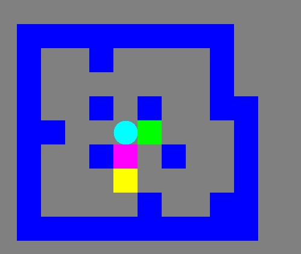
 

Po zakończeniu rozgrywki (po spełnieniu wymagania, aby wszystkie skrzynia znalazły się na miejscach docelowych) naszym oczom ukazuje się okienko informujące nas o zwycięstwie oraz pokazujące ilość zdobytych przez nas punktów.
 

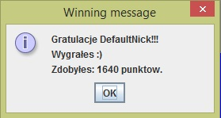
 

Po zatwierdzeniu przyciskiem „OK” lub czerwonej ikonki z „iksem” następuje przejście do menu głównego.
W tym momenci możemy sprawdzić czy nasz wynik znalazł się wśród trzech najlepszych wybierając opcję „Najlesze wyniki” w menu głównym.
 

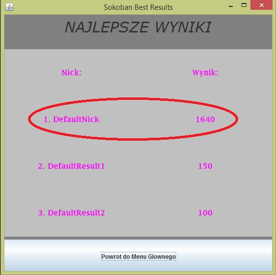
 

## Elementy dodatkowe

W grze przewidziane są 4 elementu dodatkowe do użytku gracza. Ich ilość jest zależna od każdego poziomu oraz od wybranego przez gracza poziomu trudności.
 

Użytkownik otrzymuje dostęp do 4 następujących elementów dodatkowych:
1. reset – pozwala na powrót do początkowego stanu rozgrywki, tzn. wszystkie elementy rozgrwki ustawiane są spowrotem na miejsca początkowe.
2. cofanie – pozwala na jednorazowe pociągnięcie skrzyni „do tyłu”.
3. usuwanie – pozwala na usunięcie skrzyni z planszy, dzięki temu gracz ma do ustawienia n skrzyń na n+1 miejscach docelowych.
4. teleport – pozwala na zmianę położenia gracza w wybrane miejsce na planszy bez naliczania dodatkowych ruchów/kroków.
 

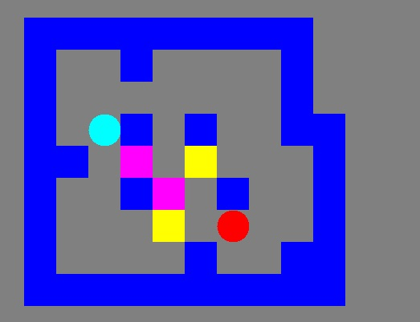
 

Powyższa grafika przedstwaia wygląd opcji teleportu. Na miejscu gracza pojawia się czerwony owal, którym możemy poruszać się po planszy. W momencie ustawienia czerwonego owalu na wybranym miejscu możemy przenieść tam owal błękitny.

## Sterowanie

Podczas poruszania się po interfejsie w oknie menu głównego oraz oknie najlepszych wyników sterowanie odbywa się za pomocą myszki. Klikamy interesujące nas przyciski, w ten sposób poruszając się po aplikacji.
 

W oknie rozgrywki sterowanie przechodzi na klawiaturę. Poniżej znajduje się opis wykorzystywanych podczas rozgrywki klawiszy.
1) strzałki (w górę, w dół, w prawo, w lewo) - służą do poruszania się graczem (błękitnym owalem),
2) przycisk Escape - służy do powrotu do menu głównego,
3) przycisk R – służy do wywołania opcji resetu,
4) przycisk T – jednorazowo kliknięty służy do wejścia w stan teleportacji (na ekranie pojawia się czerwony 	owal, który umieszczamy w miejscu, w które chcemu się teleportować), drugie kliknięcie powoduje zamknięcie 	akcji teleportacji (tzn. przenosi gracza w wybrane miejsce – czerwony owal znika z plansz),
5) przycisk Shift – w momencie, w którym gracz znajduje się przy skrzyni, użytkownik może wcisnąć przycisk 	Shift oraz strzałkę wskazującą w kierunku skrzyni, którą użytkownik chce usunąć,
6) przycisk Ctrl – analogicznie jak w przypadku klawisza Shift – znajdując się przy skrzyni, klikając 	klawisz Ctrl oraz strzałkę w stronę, w którą chcemy cofnąć skrzynię uzyskamy porządany efekt,
7) przycisk P – wywołuję opcję pauzy, tzn. animacja ruchu gracza przerywa się przy wciśnięciu klawisza P, 	przy kolejnym jego wciśnięciu animacja zostaje wznowiona.

